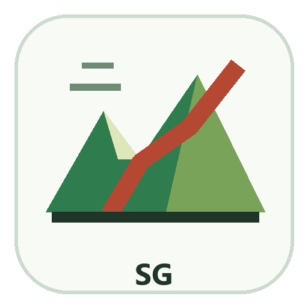

# SlopeGuard AI



**Version:** Prototype 01  
**Platform:** Windows  
**Application Type:** Desktop-style landslide monitoring and susceptibility mapping software

SlopeGuard AI is a geospatial software prototype for landslide monitoring. It helps users process DEM, Sentinel-2, InSAR, and landslide inventory data into terrain products, raster previews, analysis stacks, model-comparison outputs, interpretation drafts, and report-ready results.

## Download For Windows

Recommended download:

[**Download SlopeGuard AI Prototype 01 Windows Package (.zip)**](release/windows/SlopeGuard_AI_Prototype_01_Windows_Package.zip)

This ZIP contains the EXE and all required support files.

Individual EXE:

[**SlopeGuard_AI_Prototype_01_Windows.exe**](release/windows/SlopeGuard_AI_Prototype_01_Windows.exe)

Keep these required support files in the same folder as the EXE:

```text
SlopeGuard_AI.dll
SlopeGuard_AI.deps.json
SlopeGuard_AI.runtimeconfig.json
```

The Windows release folder is:

```text
release/windows/
```

After downloading the ZIP, extract it and double-click:

```text
SlopeGuard_AI_Prototype_01_Windows.exe
```

## Available Options

SlopeGuard AI Prototype 01 includes the following software options:

- **Project Setup**
  - Create/open project configuration
  - Set CRS, resolution, output folder, and AOI path

- **DEM Processing**
  - Slope
  - Aspect
  - TWI
  - Hillshade

- **Sentinel-2 Processing**
  - NDVI
  - EVI
  - Bare Soil Index
  - NDWI
  - Simple LULC classification

- **Sentinel-1 / InSAR**
  - Register LOS velocity raster
  - Register mean coherence raster
  - Generate PNG/JPG map previews

- **Landslide Inventory**
  - Rasterize vector inventory
  - Align inventory mask to DEM grid
  - Create binary landslide mask

- **Raster Preview**
  - Open existing GeoTIFF files inside the interface
  - Automatically create PNG and JPG map previews

- **Stack Builder**
  - Prepare feature stack manifest
  - Export feature table scaffold

- **Machine Learning**
  - Model-comparison scaffold
  - Without-InSAR vs with-InSAR experiment setup
  - Outputs for AUROC, F1-score, precision, recall workflow

- **Interpretation**
  - Draft explanation of feature influence
  - InSAR contribution discussion
  - Geomorphological interpretation support

- **Report Generator**
  - PDF report shell
  - One-slide PDF summary
  - Metrics and interpretation placeholders

## Output Formats

SlopeGuard AI saves outputs in GIS and report-friendly formats:

```text
.tif   GeoTIFF raster outputs
.png   map preview images
.jpg   map preview images
.csv   model and feature tables
.json  project and processing metadata
.pdf   report and one-slide summary
```

## User Manual

Read the manual here:

[User Manual - Markdown](docs/User_Manual_SlopeGuard_AI.md)  
[User Manual - HTML](docs/User_Manual_SlopeGuard_AI.html)

## Notes

- This is **Prototype 01**, intended for demonstration, testing, and further development.
- The EXE is a Windows desktop launcher for the local SlopeGuard AI application.
- Keep the downloaded repository folder structure intact so the launcher can find the application files.
